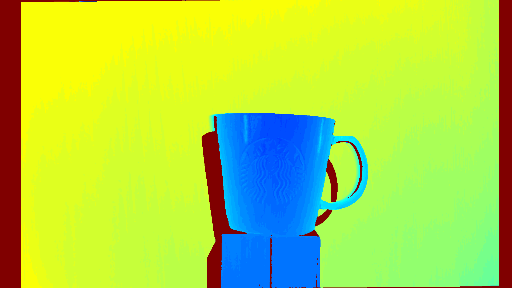

# 3D reconstruction using Apple Spatial Video and spacetime stereo algorithm

object 3D reconstruction using spacetime stereo approach and Apple spatial video sequence captured by iphone 15 pro

# Requirements
 - opencv
 - open3d
 - spacetimestereo

# Starbucks cup dataset
 <video src="docs/starbucks_cup_laser.mp4" controls="controls" style="width: 800px;"> </video>

 <video src="docs/starbucks_cup_animation.mp4" controls="controls" style="width: 800px;"> </video>

 


# Usage

```
python run_reconstruction.py
```

# References 
- [spacetime stereo python library](https://github.com/maximm8/spacetimestereo)
- [Spacetime Stereo: A Unifying Framework for Depth from Triangulation.](https://graphics.stanford.edu/papers/SpacetimeStereo/)  
   James Davis, Ravi Ramamoothi, Szymon Rusinkiewicz.  
Computer Vision and Pattern Recognition (CVPR), 2003  

